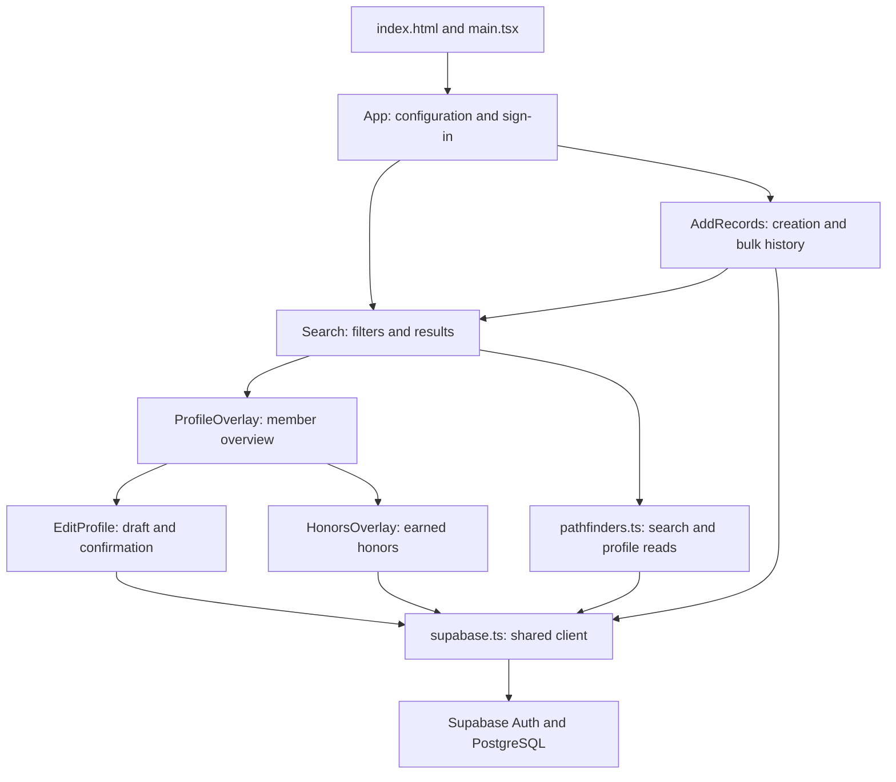

# How the FLC Pathfinder application works

This is a guided reference to the implementation, written for someone new to the repository. Read the [short code guide](code-guide.md) first for basic terminology. Use the [README](../README.md) to run the project and the [database schema](database-schema.md) for column-level rules.

This reference describes the source through migration `20260916050000_achievements_staff_search.sql`. It does not establish which migrations a hosted database has applied. Historical SQL is described separately from current behavior.

## Contents

- [The overall design](#the-overall-design)
- [Startup and sign-in](#startup-and-sign-in)
- [Searching and loading member data](#searching-and-loading-member-data)
- [Creating profiles and adding history](#creating-profiles-and-adding-history)
- [Viewing and editing profiles](#viewing-and-editing-profiles)
- [Shared controls](#shared-controls)
- [Types, styles, and artwork](#types-styles-and-artwork)
- [Database behavior](#database-behavior)
- [Migration map](#migration-map)
- [Tests and configuration](#tests-and-configuration)
- [Where to make common changes](#where-to-make-common-changes)
- [Keeping this explanation current](#keeping-this-explanation-current)

## The overall design

The application has two main working parts. React builds the screens in the browser. Supabase provides sign-in and a PostgreSQL database. There is no separate custom application server in this repository: the browser reads tables/views and calls database functions through the Supabase client.

The arrow from additions to Search represents reuse of the search screen as a recipient picker. Reusing it keeps filtering and pagination consistent between browsing and bulk additions.

Three concepts must stay separate:

| Concept              | Meaning                                                         | Why it is separate                                             |
| -------------------- | --------------------------------------------------------------- | -------------------------------------------------------------- |
| Auth account         | Someone who can sign in and use the application                 | Access is not determined by a member's participation status.   |
| Permanent person     | The member's name, birthday, notes, and historical achievements | A person remains in the database after becoming inactive.      |
| Current registration | Current season, status, and class/title                         | Present-day information can change without rewriting the past. |

UI state is temporary. Changing an input usually changes a local draft, not the database. Confirmed writes pass through database validation; a disabled button alone is not an access-control rule.

## Startup and sign-in

### [index.html](../index.html) and [main.tsx](../src/main.tsx)

The HTML supplies the root element and loads the browser entry module. `main.tsx` imports the shared stylesheet and mounts `App` with React's root renderer. `StrictMode` helps expose lifecycle problems during development, which is one reason effects include cleanup.

### [App.tsx](../src/App.tsx)

| Section              | What it does                                                                                        | Why it exists                                                                                                 |
| -------------------- | --------------------------------------------------------------------------------------------------- | ------------------------------------------------------------------------------------------------------------- |
| `App`                | Attempts to obtain the Supabase client and shows setup instructions if configuration is unavailable | Missing environment settings produce a usable explanation instead of mounting screens that cannot fetch data. |
| `Header`             | Renders branding and optional action controls supplied as children                                  | Sign-in and signed-in screens share the same header.                                                          |
| `ConnectedApp` state | Tracks session, request errors, pending sign-in/sign-out, and `recordsVersion`                      | Coordinates the top-level screens and refreshes.                                                              |
| Session effect       | Reads the saved session and subscribes to auth changes; unsubscribes on cleanup                     | Keeps the screen consistent with sign-in state and avoids updates after unmounting.                           |
| `signIn`             | Reads email/password from the submitted form and calls Supabase Auth                                | Uses administrator-provisioned accounts rather than an application signup flow.                               |
| `signOut`            | Ends the local browser session                                                                      | Does not sign the user out of other devices.                                                                  |
| Render branches      | Shows session loading, the staff login form, or Search and addition controls                        | A user sees only the screen appropriate to the current session state.                                         |

`session === undefined` means the initial session check is unfinished; `null` means signed out. After an addition, incrementing `recordsVersion` tells Search to reload. It does not replace the filter draft. The user ID used as a component key causes session-specific screen state to reset when the account changes.

### [supabase.ts](../src/lib/supabase.ts)

`getSupabase()` creates one client on first use and returns that same client thereafter. The module reads `VITE_SUPABASE_URL` and `VITE_SUPABASE_PUBLISHABLE_KEY`; Vite includes these values in the browser bundle. A secret or service-role key does not belong in these settings.

The local `Database` type adjusts two generated RPC argument types: unknown birthdays and unknown history years can be `null`, which the generated function signatures do not fully express. This is a compile-time correction, not a change to database validation.

## Searching and loading member data

### [Search.tsx](../src/features/search/Search.tsx)

Search works both as the main browse screen and as the bulk-addition recipient selector. The optional `selection` prop provides selected people, a toggle callback, and the rule for excluding current Pathfinders from staff-title additions.

| Section/function           | What it does and why                                                                                                                    |
| -------------------------- | --------------------------------------------------------------------------------------------------------------------------------------- |
| `draft` and `filters`      | Keep visible edits separate from the submitted query so choosing each filter does not immediately fetch a new page.                     |
| `members`, `count`, `page` | Store the current server page and total result count. Pagination is performed in the database request.                                  |
| `selected`                 | Holds the member ID whose profile dialog is open. It is separate from the recipient selection supplied by a parent.                     |
| `attempt`                  | Changes to retry the same query or reload after a profile edit.                                                                         |
| Loading effect             | Fetches when submitted filters, page, refresh counters, or eligibility change. Aborts obsolete requests and ignores their late results. |
| `update`                   | Replaces one draft filter while preserving the others.                                                                                  |
| `beginSearch`              | Clears stale results, count, errors, and the open profile, and marks the next request busy.                                             |
| `submit`                   | Copies the draft to active filters and returns to page zero.                                                                            |
| `reset`                    | Clears inputs and active filters, including the honors placeholder.                                                                     |
| Filter form                | Presents name, status, years, levels, extracurriculars, and Red Zone choices.                                                           |
| Results table              | Shows current registration information and optional recipient checkboxes. A separate icon before First Name opens profile dialogs.      |
| Pagination                 | Disables invalid navigation and navigation while busy. The display is one-based although state is zero-based.                           |

The History type selector switches between Pathfinder achievements and historical Staff titles. It clears incompatible draft choices on switching; submission still applies the query. Staff titles load from the ordered catalog with a retry action on failure. `search_staff_titles` contains name/year pairs, so current Status and historical title matching stay independent. Master Guide is included as a plain Pathfinder achievement.

The general Honors search control is a placeholder; it does not filter the database. Honor lookup during additions and earned-honor display are implemented independently.

### [pathfinders.ts](../src/lib/pathfinders.ts)

This module combines the shared domain option lists with the main read queries. `LEVELS` remains the eight current class choices; `ACHIEVEMENTS` adds Master Guide for historical addition, display, and search. Its optional outcome is absent for Master Guide.

| Export/helper                                                | Responsibility                                                                                                                                                                |
| ------------------------------------------------------------ | ----------------------------------------------------------------------------------------------------------------------------------------------------------------------------- |
| `LEVELS`, `ACHIEVEMENTS`, `ACTIVITIES`, `EVENTS`, `STATUSES` | Shared labels and ordering used across screens. These must agree with database rules.                                                                                         |
| `DRUMS`, `OPERATIONS`, `PBE_REGIONS`, `PLACEMENTS`           | Allowed detail choices. Region order also expresses PBE progression. Stored spellings are data contracts, not merely display text.                                            |
| `YEARS`, `period`, `PERIODS`                                 | Build calendar options from 2010 through the browser's current year and compact periods such as `2023-24`. This is distinct from the database-configured current club season. |
| Detail maps and `historyOptions`                             | Produce broad choices and narrower choices such as `Drums / Snare`.                                                                                                           |
| `historyFilter`                                              | Splits a selected label into category and detail while preserving nested PBE detail text.                                                                                     |
| `Filters`, `EMPTY_FILTERS`, `PAGE_SIZE`                      | Describe the query inputs, blank starting state, and 25-row page size.                                                                                                        |
| `member`                                                     | Gives database-validated JSON fields more useful TypeScript shapes. Type assertions do not perform runtime validation.                                                        |
| `contains`                                                   | Encodes JSON containment operands for PostgREST's query grammar, including quote and backslash escaping.                                                                      |
| `historySearchExpression`                                    | Validates selected options and builds the combined history query.                                                                                                             |
| `searchPathfinders`                                          | Applies status, eligibility, literal name search, history conditions, stable ordering, pagination, and cancellation. Returns rows plus a count.                               |
| `getPathfinder`                                              | Loads the person and related histories alongside effective status, then organizes records for the profile screen.                                                             |
| `Pathfinder`, `PathfinderDetails`                            | Share the search-row and assembled-profile result types with callers.                                                                                                         |

#### How combined filters work

Selected choices within one category use OR. Selected categories use AND. Selecting Friend and Companion with Drums means a matching level **and** Drums, not three independently required achievements. A selected year must belong to the same history entry as the selected detail.

For example, a synthetic record with Snare in `2022-23` and Bass in `2023-24` must not match “Snare in `2023-24`.” The query matches year/detail pairs rather than finding the instrument and year independently anywhere in a profile.

Calendar-year inputs expand to adjacent club periods for level matching. The visible Years picker currently offers club periods. When years are the only selected history filter, the query browses participation years. Unknown history years do not match a specific known period.

`searchPathfinders` orders by status, title priority, surname, first name, and finally ID. The ID breaks ties so people with identical names do not move unpredictably between pages. Name searches escape `%` and `_` so user input does not become a wildcard pattern unintentionally.

`getPathfinder` transforms different storage shapes into activity groups: Drill has rows with arrays of years; Drums, PBE, and TLT have history arrays. The event-table array must remain in the same order as `EVENTS`. Activities and events are displayed under Pathfinder history; staff titles are handled separately, regardless of current status.

## Creating profiles and adding history

### [AddRecords.tsx](../src/features/add/AddRecords.tsx)

`AddRecords` owns the two header entry buttons. Its separate open flags show either the new-person modal or `AddToRecord`. The main creation workflow lives in `AddRecordModal`.

| Section/function                      | Explanation                                                                                                                      |
| ------------------------------------- | -------------------------------------------------------------------------------------------------------------------------------- |
| `staffTitleGroup` / `staffTitleLabel` | Group catalog titles by suffix and shorten button labels while keeping original stored values.                                   |
| Catalog loading effect                | Fetches the configured club year and staff titles; supports retry before submission.                                             |
| Personal and registration state       | Retains names, birthday, status, and compatible class/title selections across review and error screens.                          |
| `requestId`                           | A UUID retained for this mounted form. Reusing it on retry lets the database recognize a creation whose first response was lost. |
| `deadline` and countdown effect       | Arm a five-second confirmation window. Countdown uses wall-clock time rather than assuming timer callbacks run punctually.       |
| `resetConfirmation`                   | Cancels confirmation after relevant input changes.                                                                               |
| `submit`                              | First arms confirmation; a second timely submission calls `add_member_record`. Sends an unknown birthday as null.                |
| `submitting` ref                      | Blocks rapid repeated submissions before React renders the pending state.                                                        |
| Saving/error/success branches         | Explain progress, preserve inputs on failure, and show the saved summary on success.                                             |

The creation RPC writes the permanent person and registration together. The UI calls `onAdded` after success so the parent refreshes search results. Changing current class/title does not itself award a historical level.

### [AddToRecord.tsx](../src/features/add/AddToRecord.tsx)

The workflow is `details → people → review → saving → result`, with an error screen for failed requests. State lives above these render branches so screen changes do not discard the proposed information.

| Section/function          | Explanation                                                                                                       |
| ------------------------- | ----------------------------------------------------------------------------------------------------------------- |
| `Kind`, `kinds`           | Map the chosen category to the payload shape and human-readable label.                                            |
| `Receipt`                 | Represents one person's added/already/error result and whether Years Active changed.                              |
| Catalog effect            | Loads staff titles, PBE year/books, and the configured season together.                                           |
| `eligible`                | Excludes current Pathfinders only when adding staff titles.                                                       |
| `selectedDetails`         | Uses catalog books for known PBE years, no inferred books for Unknown, and selected details for other categories. |
| `entry`                   | Builds the JSON payload for the selected category, omitting irrelevant fields.                                    |
| `description` / `summary` | Explain the same proposed entry during selection, confirmation, and result display.                               |
| `next`                    | Checks that the selected category has its required fields before showing recipients.                              |
| `toggle`                  | Adds/removes recipients by stable member ID, preserving choices across pages and searches.                        |
| `save`                    | Calls `add_to_records` once, converts Unknown to null, and displays per-person results.                           |
| Result branches           | Separate added, existing, and failed entries; failed profiles can be selected for review and retry.               |

The level payload omits outcome entirely for Master Guide, and its Outcome picker is hidden.

PBE region selection is ordered. Removing an earlier region removes later regions from this draft, avoiding a gap in progression. Confirmation here has no five-second timer. The server handles duplicates and conflicts per person, so one failed recipient does not necessarily prevent successful additions to others.

### [HonorPicker.tsx](../src/features/add/HonorPicker.tsx)

The parent owns the selected `Honor` (ID and name), while this component owns search text and results. An effect waits 200 ms after a query change, retrieves up to 20 matching catalog entries, and cancels the previous timer/request when necessary. Typing a different query clears the selected honor to avoid submitting an unrelated old selection. Busy, error, retry, and no-match branches explain the lookup state.

## Viewing and editing profiles

### [ProfileOverlay.tsx](../src/features/profile/ProfileOverlay.tsx)

The loading effect requests the selected person's assembled profile and cancels stale reads. Display preparation deduplicates years and sorts levels by known year then class order, with unknown years last. Birthday is formatted by slicing its date string, avoiding a timezone conversion that could change the day.

The body shows personal information, Pathfinder history, Staff history, the honors button, and notes. `editing` and `honorsOpen` control nested dialogs. A successful edit closes the editor, reloads the overview, and notifies Search; closing without saving leaves stored data unchanged.

### Small profile display components

| File                                                             | Behavior and reason                                                                                                                                                  |
| ---------------------------------------------------------------- | -------------------------------------------------------------------------------------------------------------------------------------------------------------------- |
| [HistoryRecords.tsx](../src/features/profile/HistoryRecords.tsx) | Copies and sorts year/detail records, optionally newest first. Null years stay last in either direction. A definition list visually pairs each year with its detail. |
| [HonorsOverlay.tsx](../src/features/profile/HonorsOverlay.tsx)   | Joins earned-honor rows to catalog names, orders by earned year, and supports retry. Loading on demand avoids fetching honors for every profile browse.              |
| [ProfileNotes.tsx](../src/features/profile/ProfileNotes.tsx)     | Shows the Notes heading and any nonblank notes as read-only text. Edits belong to the reviewed profile-save workflow. CSS preserves line breaks.                     |

### [EditProfile.tsx](../src/features/profile/EditProfile.tsx)

This is the largest UI module because it edits several different database shapes through one reviewed save. A `Profile` is a table-name dictionary whose values are arrays of rows. A `Row` is a dictionary of JSON values. `Catalog` supplies staff labels, PBE books, and known earned-honor labels.

The three snapshots have distinct jobs:

| Value      | Job                                                                        |
| ---------- | -------------------------------------------------------------------------- |
| `original` | The database state when editing began; sent back for stale-edit detection. |
| `draft`    | The mutable-in-concept, immutably updated local form state.                |
| `review`   | A cloned proposal whose receipt is currently being confirmed.              |

“Immutable update” means creating a new object/array instead of altering an existing one in place. React can detect the new value, and the original snapshot stays intact.

| Function/section                         | Capability and reason                                                                                                                                 |
| ---------------------------------------- | ----------------------------------------------------------------------------------------------------------------------------------------------------- |
| `eventTables`                            | Maps event order to database table suffixes; must stay aligned with `EVENTS`.                                                                         |
| `strings`                                | Converts JSON arrays into picker strings, using Unknown for null years.                                                                               |
| Loading effect / `load`                  | Loads the full snapshot and catalogs together. If registration is missing, prepares a Not Active registration in the draft using the configured year. |
| `change`                                 | Patches one row without discarding its other fields; invalidates the previous review and error.                                                       |
| `addRow`                                 | Appends a local row without assigning a database identity.                                                                                            |
| `booksFor`                               | Looks up the authoritative PBE books for a selected year.                                                                                             |
| `removeRow`                              | Removes a row from the draft only. Database deletion waits for confirmation.                                                                          |
| `removeButton`                           | Supplies compact X buttons with descriptive accessible names.                                                                                         |
| `submit`                                 | Checks for changes and incomplete honor choices, clones the draft, normalizes changed PBE books, and opens review.                                    |
| `save`                                   | Sends original and reviewed snapshots to `update_profile`; blocks duplicate clicks and retains the review on error.                                   |
| `text`                                   | Renders text/date/year controls; handles required values, Unknown, and existing years outside the standard list.                                      |
| `choice`                                 | Renders one catalog value with optional N/A to clear it.                                                                                              |
| `multiple`                               | Preserves existing choices absent from today's option list and translates Unknown years back to null.                                                 |
| `rows`                                   | Reuses add/edit/remove layouts for ordinary table rows. Person and registration sections omit row-removal controls.                                   |
| `history` and nested `add`/`set` helpers | Edit entries inside one row's history array. New entries choose an unused listed period when possible; PBE books follow the year.                     |
| `levels` and its `update` helper         | Shows all classes. An unrecorded class uses a display-only placeholder; choosing an outcome adds a real entry, while N/A removes it.                  |
| Review branch                            | Groups Added, Updated, and Removed receipt items and offers Confirm or Back to Edit.                                                                  |
| Main form branch                         | Presents personal details, notes, current registration, levels, activities, events, and honors using the shared helpers.                              |

The Levels editor also displays Master Guide as a plain achievement with year controls, an Add button when absent, and removal controls for recorded instances. Current Registration no longer has an activities input or payload field.

Saving is atomic: validation failure rolls back the database operation. If another user changed the profile since loading, the database rejects the stale snapshot rather than silently overwriting that work. Confirmation has no timeout. The permanent profile and current registration cannot be removed through this editor.

### [profileChanges.ts](../src/features/profile/profileChanges.ts)

`profileChanges(original, proposed, honors)` is a pure comparison: it does not fetch or save. The `labels` dictionary selects visible fields and hides internal IDs. `tables` supplies section labels.

1. `display` turns missing values, arrays, objects, statuses, and honor IDs into readable text. Displayed arrays are sorted for comparison.
2. `describe` combines visible row fields. Derived PBE books are omitted from those receipt descriptions.
3. `flatten` turns differing table shapes into comparable items: personal fields, level instances, registration fields, and history entries.
4. Exact unchanged items are paired and removed first, preventing an untouched duplicate from being mistaken for an edit.
5. Remaining matching keys become Updated; unmatched original items become Removed; unmatched proposed items become Added.

This receipt is a presentation summary. The database validates the full snapshots, not the receipt text.

## Shared controls

### [Modal.tsx](../src/components/Modal.tsx)

The native `<dialog>` provides modal behavior. The mounting effect opens it, remembers the previous focused element and body scroll setting, locks background scrolling, and restores those values on cleanup. The title effect resets scroll/focus when a multi-step dialog changes screens.

`header`, `headerActions`, and `children` are content supplied by callers. `wide` expands recipient-selection dialogs. `hideClose` allows custom confirmation controls. `closeDisabled` blocks the close action and Escape while a save is pending. Escape is routed through the parent callback so React and the browser agree about whether the dialog is open.

### [MultiSelect.tsx](../src/components/MultiSelect.tsx)

This component is more than a dropdown: it supports typing, removable selections, keyboard navigation, grouped choices, and optional single-choice behavior.

| Part                                 | Explanation                                                                                                   |
| ------------------------------------ | ------------------------------------------------------------------------------------------------------------- |
| `values` / `onChange`                | Parent-owned selected values; the component reports replacements rather than storing a second selection list. |
| `groupKey`                           | Supports broad category selections that cover narrower choices.                                               |
| `exclusiveKey`                       | Prevents selecting multiple values from an exclusive group, such as two placements for the same region.       |
| `optionGroup` / `variantLabel`       | Control visual grouping and shorter labels.                                                                   |
| `detailOptions` / `detailSelections` | Narrow grouped variants; typing a recognized detail can reveal it directly.                                   |
| `positionOptions` / `openOptions`    | Measure available viewport space, position the menu above or below, and open it.                              |
| Resize/scroll effect                 | Keeps an open menu aligned even inside a scrolling modal.                                                     |
| `matches`                            | Applies typed text, detail filtering, and removal of already-selected choices.                                |
| `disabled`                           | Enforces caller restrictions, duplicate prevention, broad-group coverage, and exclusivity.                    |
| `add`                                | Applies selection rules, clears text, and restores input focus; closes the menu for single-choice mode.       |
| Form-reset effect                    | Clears local menu/search state when the containing form resets.                                               |
| Keyboard handlers                    | Move the active option with arrows, select with Enter, and close with Escape.                                 |
| Mouse/focus handlers                 | Keep focus while choosing options and let nested group buttons/selects handle their own interactions.         |

Search opts into `closeOnSelect`, which closes the menu after either mouse or Enter selection while leaving the selected bubble visible. Other forms keep the default multi-select behavior.

The input uses `aria-activedescendant` to identify the active option while retaining keyboard focus. Removing a selected chip uses a `type="button"` control so it does not submit a surrounding form.

### [Select.tsx](../src/components/Select.tsx) and display helpers

`Select` renders a labeled native single-choice filter; its blank option means no restriction. [format.ts](../src/lib/format.ts) supplies `statusLabel` for display wording and `detailKind` for nouns such as instrument, region, and outcome. [errors.ts](../src/lib/errors.ts) extracts a message from unknown thrown values or supplies a fallback. It does not translate database errors or change their underlying cause.

## Types, styles, and artwork

[database.types.ts](../src/lib/database.types.ts) is generated from Supabase. `Json` describes allowed JSON values. `Database` contains table Row/Insert/Update shapes, relationships, views, RPC arguments/results, and enum/composite metadata. Helpers such as `Tables`, `TablesInsert`, and `TablesUpdate` retrieve those types. These declarations help the compiler; they do not execute queries or replace runtime validation. Regenerate this file after schema changes rather than annotating each generated field manually.

[index.css](../src/index.css) owns the shared appearance. Its sections cover addition forms and receipts, base typography/buttons, search filters and tables, dialogs, multi-select menus, profile histories, and the editor. Media queries adapt columns, spacing, and headers to narrower screens. Overflow rules make large tables and profiles scrollable. Note/receipt text preserves line breaks. Later rules refine earlier ones, so moving rules can change appearance even when declarations stay the same.

`src/assets/FL_Logo.png` is imported by the header. `Club Logo - 2020.png` and `flc-logo.svg` are retained artwork with no current source import. Their presence does not mean they are displayed. Binary images are assets rather than executable sections to document line by line.

## Database behavior

The [schema reference](database-schema.md) documents each current data shape. The main relationships are:

- `pathfinders` is the permanent parent row; `current_data` holds registration.
- `staff_titles`, `honors`, and `pbe_year_books` provide allowed labels or year-linked catalogs.
- `staff_history`, `drill`, `drum_corps`, `pbe`, and `tlt` store participation details.
- The `red_zone_*` tables store results for their corresponding event types.
- `honors_earned` links a person to an honor and optional year.
- `member_search` is a view assembling current display fields, ordering keys, and historical search fields. It is not a second editable copy of each person.

| Database mechanism                             | What it contributes                                                                                                                                            |
| ---------------------------------------------- | -------------------------------------------------------------------------------------------------------------------------------------------------------------- |
| `current_staff_role()`                         | Maps an authenticated identity to application editor access. The old private allowlist no longer controls access.                                              |
| `current_club_year()`                          | Supplies the intentionally configured season, currently `2026-27` in this migration history. It does not roll over automatically in January.                   |
| Validation functions and constraints           | Check JSON structure, allowed options, years, required fields, and duplicate rules.                                                                            |
| Triggers                                       | Run automatically on writes to normalize registration, maintain timestamps, and protect valid relationships/catalog references.                                |
| `add_member_record`                            | Creates a person and registration together with retry recognition via request ID.                                                                              |
| `append_period_details` / `append_pbe_history` | Merge history without discarding unrelated years/details; PBE also handles region results.                                                                     |
| `add_to_records`                               | Validates and merges one proposed entry for multiple recipients with per-person outcomes.                                                                      |
| `get_profile_for_edit`                         | Returns consistently ordered table-row arrays for one person's editable snapshot.                                                                              |
| `update_profile`                               | Locks relevant rows, checks the original snapshot, validates allowed fields/identities, normalizes PBE books, and applies reviewed additions/updates/removals. |
| Policies and grants                            | Deny anonymous member access and constrain authenticated operations. Current reviewed-save deletion is limited to allowed history instances.                   |

The latest `update_profile` runs with definer privileges because it must remove reviewed history while direct table DELETE remains unavailable. That makes its explicit authentication check, table/column allowlist, member ownership predicates, immutable identity checks, and fixed search path essential. It requires exactly one permanent-person row and one registration row in the proposal. These are backend protections, not merely hidden UI buttons.

Historical private backup tables preserve data from structural conversions. They are administrator-oriented migration artifacts, not frontend data sources. Do not remove a migration because a later file replaces one of its functions: a fresh database and an upgrading database both depend on the sequence.

## Migration map

Each filename below links to the historical step it describes. An early rule may have been replaced later; this is a chronology, not a list of rules simultaneously active today.

| Migration                                                                                                                   | Purpose of that step                                                                                    |
| --------------------------------------------------------------------------------------------------------------------------- | ------------------------------------------------------------------------------------------------------- |
| [20260908000000_pathfinder_database.sql](../supabase/migrations/20260908000000_pathfinder_database.sql)                     | Creates the original tables, JSON validators, participation checks, indexes, and access policies.       |
| [20260911000000_auth_users_are_staff.sql](../supabase/migrations/20260911000000_auth_users_are_staff.sql)                   | Replaces allowlist-based access with authenticated-user editor access.                                  |
| [20260911010000_current_data.sql](../supabase/migrations/20260911010000_current_data.sql)                                   | Introduces current registration, the configured season, and the combined search view.                   |
| [20260911020000_registration_status.sql](../supabase/migrations/20260911020000_registration_status.sql)                     | Adds the earlier registration/graduation model, subsequently revised.                                   |
| [20260911030000_searchable_status.sql](../supabase/migrations/20260911030000_searchable_status.sql)                         | Exposes effective status for server-side filtering.                                                     |
| [20260911040000_pbe_tlt_arrays.sql](../supabase/migrations/20260911040000_pbe_tlt_arrays.sql)                               | Converts earlier scalar activity details to linked arrays.                                              |
| [20260911050000_pbe_year_history.sql](../supabase/migrations/20260911050000_pbe_year_history.sql)                           | Pairs each PBE year's books in a history entry and protects catalog consistency.                        |
| [20260911060000_tlt_year_history.sql](../supabase/migrations/20260911060000_tlt_year_history.sql)                           | Establishes an earlier calendar-year TLT history model.                                                 |
| [20260911070000_activity_year_search.sql](../supabase/migrations/20260911070000_activity_year_search.sql)                   | Adds activity/year search pairs.                                                                        |
| [20260912000000_event_year_search.sql](../supabase/migrations/20260912000000_event_year_search.sql)                         | Adds linked Red Zone event/year filtering.                                                              |
| [20260912010000_detail_participation_search.sql](../supabase/migrations/20260912010000_detail_participation_search.sql)     | Makes detailed records authoritative for participation search.                                          |
| [20260912020000_remove_core_participation.sql](../supabase/migrations/20260912020000_remove_core_participation.sql)         | Removes redundant core participation arrays.                                                            |
| [20260912030000_history_detail_filters.sql](../supabase/migrations/20260912030000_history_detail_filters.sql)               | Adds more detailed historical search fields.                                                            |
| [20260914000000_member_revision.sql](../supabase/migrations/20260914000000_member_revision.sql)                             | Preserves a backup and revises member names, statuses, compact periods, and historical structures.      |
| [20260914010000_period_search.sql](../supabase/migrations/20260914010000_period_search.sql)                                 | Revises search for period-based history.                                                                |
| [20260915100000_diagnostic.sql](../supabase/migrations/20260915100000_diagnostic.sql)                                       | Reports diagnostic state without changing application data.                                             |
| [20260915110000_current_season_default.sql](../supabase/migrations/20260915110000_current_season_default.sql)               | Handles missing current seasons and establishes the default.                                            |
| [20260915120000_staff_drum_history.sql](../supabase/migrations/20260915120000_staff_drum_history.sql)                       | Consolidates staff titles and drum instruments into period-linked histories.                            |
| [20260915130000_current_title_json.sql](../supabase/migrations/20260915130000_current_title_json.sql)                       | Converts current titles to validated arrays.                                                            |
| [20260915140000_add_record.sql](../supabase/migrations/20260915140000_add_record.sql)                                       | Introduces atomic person creation and retry request IDs.                                                |
| [20260915150000_add_record_years_active.sql](../supabase/migrations/20260915150000_add_record_years_active.sql)             | Records the creation season in Years Active.                                                            |
| [20260915160000_add_record_validation.sql](../supabase/migrations/20260915160000_add_record_validation.sql)                 | Tightens new-profile registration validation.                                                           |
| [20260915170000_history_additions.sql](../supabase/migrations/20260915170000_history_additions.sql)                         | Introduces merging helpers and bulk history additions.                                                  |
| [20260915180000_simplify_history_additions.sql](../supabase/migrations/20260915180000_simplify_history_additions.sql)       | Removes the historical-role input from the addition workflow.                                           |
| [20260915190000_remove_history_role.sql](../supabase/migrations/20260915190000_remove_history_role.sql)                     | Backs up and consolidates history while removing redundant role columns.                                |
| [20260915200000_pbe_region_results.sql](../supabase/migrations/20260915200000_pbe_region_results.sql)                       | Adds per-region PBE placements and result-aware merging.                                                |
| [20260915210000_pbe_region_progression.sql](../supabase/migrations/20260915210000_pbe_region_progression.sql)               | Enforces progression when merging PBE region results.                                                   |
| [20260915220000_pbe_search_results.sql](../supabase/migrations/20260915220000_pbe_search_results.sql)                       | Exposes region/placement pairs to search.                                                               |
| [20260915230000_history_duplicate_rules.sql](../supabase/migrations/20260915230000_history_duplicate_rules.sql)             | Refines duplicate handling for history additions.                                                       |
| [20260916000000_unknown_history_years.sql](../supabase/migrations/20260916000000_unknown_history_years.sql)                 | Permits unknown historical dates and adapts validation/merging while keeping registration years strict. |
| [20260916010000_edit_profile.sql](../supabase/migrations/20260916010000_edit_profile.sql)                                   | Introduces editable snapshots and stale-safe profile updates.                                           |
| [20260916020000_edit_profile_additions.sql](../supabase/migrations/20260916020000_edit_profile_additions.sql)               | Extends profile saves to new history entries.                                                           |
| [20260916030000_edit_profile_removals.sql](../supabase/migrations/20260916030000_edit_profile_removals.sql)                 | Allows reviewed history removal through a restricted definer RPC.                                       |
| [20260916040000_preserve_current_registration.sql](../supabase/migrations/20260916040000_preserve_current_registration.sql) | Requires registration in the reviewed save and prevents its removal.                                    |

| [20260916050000_achievements_staff_search.sql](../supabase/migrations/20260916050000_achievements_staff_search.sql) | Backs up affected records, moves Master Guide into dated achievements, retires current activities, and exposes historical Staff title/year search. |

## Tests and configuration

### Tests

| File                                            | What it exercises                                                                               | Why it is separate                                                                                       |
| ----------------------------------------------- | ----------------------------------------------------------------------------------------------- | -------------------------------------------------------------------------------------------------------- |
| [database.test.mjs](../tests/database.test.mjs) | Earlier migration stages, validation, relationships, search fields, and access rules in PGlite  | Verifies upgrade-era contracts as well as foundational behavior.                                         |
| [revision.test.mjs](../tests/revision.test.mjs) | Complete ordered migration replay with legacy fixtures and current history/edit operations      | Checks that old data can reach the current schema and that current writes remain valid.                  |
| [search.spec.ts](../tests/ui/search.spec.ts)    | Search, additions, profile dialogs, editing receipts, failures, retries, and mobile interaction | Uses mocked Supabase responses to isolate browser behavior; it cannot prove hosted database permissions. |

Database tests create a minimal Auth schema/role contract inside a local PostgreSQL engine. Browser fixtures create synthetic sessions and route responses. Neither test suite is intended to modify hosted member records. Individual named tests explain the scenario; setup helpers build the common starting state.

[achievements.test.mjs](../tests/achievements.test.mjs) upgrades dated, undated, current-only, and unaffected fixtures through the new migration. It checks historical preservation, private backups, removed columns, title/year matching, Master Guide validation and duplicate handling, and reviewed saves.

### Project files

| File/directory                                                                                                                                | What it does and why                                                                                                                                            |
| --------------------------------------------------------------------------------------------------------------------------------------------- | --------------------------------------------------------------------------------------------------------------------------------------------------------------- |
| [package.json](../package.json)                                                                                                               | Declares runtime and development dependencies plus commands. `build` runs TypeScript checks before Vite bundling; `preview` serves the built output locally.    |
| [package-lock.json](../package-lock.json)                                                                                                     | Pins resolved dependency versions/integrities for repeatable installation. Maintain through npm.                                                                |
| [vite.config.ts](../vite.config.ts)                                                                                                           | Enables React support in the development server and production bundler.                                                                                         |
| [tsconfig.json](../tsconfig.json)                                                                                                             | References separate browser and tooling TypeScript projects.                                                                                                    |
| [tsconfig.app.json](../tsconfig.app.json)                                                                                                     | Configures browser/JSX types, module handling, and unused-code checks for `src`.                                                                                |
| [tsconfig.node.json](../tsconfig.node.json)                                                                                                   | Configures Node-oriented checking for Vite configuration.                                                                                                       |
| [playwright.config.ts](../playwright.config.ts)                                                                                               | Runs Edge against a dedicated Vite server on port 4173 with mock Supabase settings.                                                                             |
| [.oxlintrc.json](../.oxlintrc.json)                                                                                                           | Configures lint plugins and React rules for hooks and component exports.                                                                                        |
| [.prettierrc.json](../.prettierrc.json)                                                                                                       | Defines consistent indentation, quotes, line width, semicolons, and line endings.                                                                               |
| [.prettierignore](../.prettierignore)                                                                                                         | Excludes generated files, dependency/build artifacts, and immutable migration history from formatting.                                                          |
| [.env.example](../.env.example)                                                                                                               | Names the public browser configuration variables without supplying private credentials. Local `.env.local` is ignored and is not reproduced in this guide.      |
| [.gitignore](../.gitignore)                                                                                                                   | Keeps secrets, dependencies, build products, logs, and test artifacts out of version control.                                                                   |
| [.gitattributes](../.gitattributes)                                                                                                           | Enables Git's automatic text normalization.                                                                                                                     |
| [supabase/config.toml](../supabase/config.toml)                                                                                               | Configures the optional local Supabase services, ports, database, migrations, seed, and Auth behavior. This file alone does not change hosted project settings. |
| [supabase/seed.sql](../supabase/seed.sql)                                                                                                     | Intentionally empty member-data seed, avoiding committed real records.                                                                                          |
| [grant-initial-staff.sql](../supabase/admin/grant-initial-staff.sql)                                                                          | Retired explanatory script from the old access model; provision accounts through Auth.                                                                          |
| [LICENSE](../LICENSE)                                                                                                                         | Describes the project's license terms.                                                                                                                          |
| `node_modules`, `dist`, `test-results`, `playwright-report`                                                                                   | Installed dependencies, generated build output, and test output, when present. They are not maintained application source.                                      |
| [README.md](../README.md), [project-context.md](project-context.md), [database-schema.md](database-schema.md), [code-guide.md](code-guide.md) | Setup/features, ministry background, detailed storage rules, and the short reading guide, respectively.                                                         |
| [skills/explain-codebase/SKILL.md](../skills/explain-codebase/SKILL.md)                                                                       | Reusable instructions for producing and updating explanations like this one.                                                                                    |

## Where to make common changes

| Desired change                     | Start here                                         | Also inspect                                                                             |
| ---------------------------------- | -------------------------------------------------- | ---------------------------------------------------------------------------------------- |
| Add a search filter                | `Search.tsx`, `Filters`, `historySearchExpression` | Search view fields, query validation, database and browser tests.                        |
| Change a current status/title rule | `AddRecords.tsx`, `EditProfile.tsx`                | Database registration validation and the staff title catalog.                            |
| Add a new history category         | `AddToRecord.tsx`, profile/editor rendering        | Tables, snapshot allowlist, merge RPC, search view, receipt labels, and generated types. |
| Change confirmation behavior       | The relevant addition/editor module                | Keep new-person timer behavior distinct from untimed bulk/edit receipts.                 |
| Adjust modal or menu behavior      | `Modal.tsx`, `MultiSelect.tsx`, `index.css`        | Nested-dialog focus, keyboard use, mobile scrolling, and all callers.                    |
| Roll over the current club season  | A new migration updating `current_club_year()`     | Current registration handling and year options; browser date alone is not a rollover.    |
| Change a database shape            | A new SQL migration                                | Regenerated types, RPC payloads, fixtures, schema documentation, and this reference.     |

## Keeping this explanation current

Invoke the installed skill with `$explain-codebase` and ask it to update this reference after implementation changes. A useful request is: “Use $explain-codebase to refresh docs/code-reference.md from this repository, including function responsibilities and database changes.” The repository copy is linked above for review and portability.

The skill should inspect actual source and distinguish intended behavior, tested behavior, and unknown deployment state. Documentation work alone should not rewrite runtime code, generated types, or applied migrations. Links and file/function coverage should be checked whenever the guide changes.
